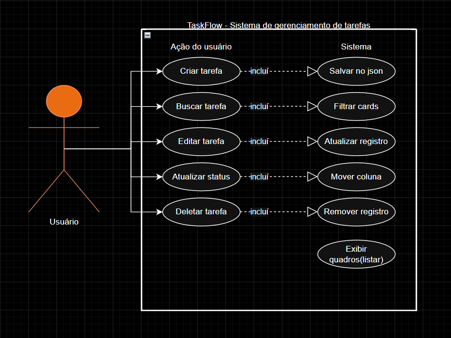
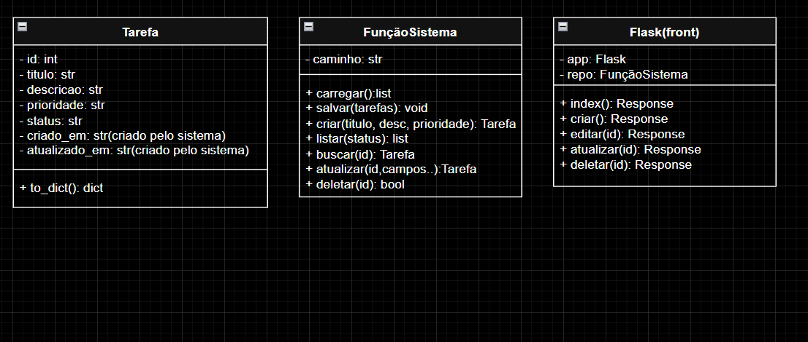
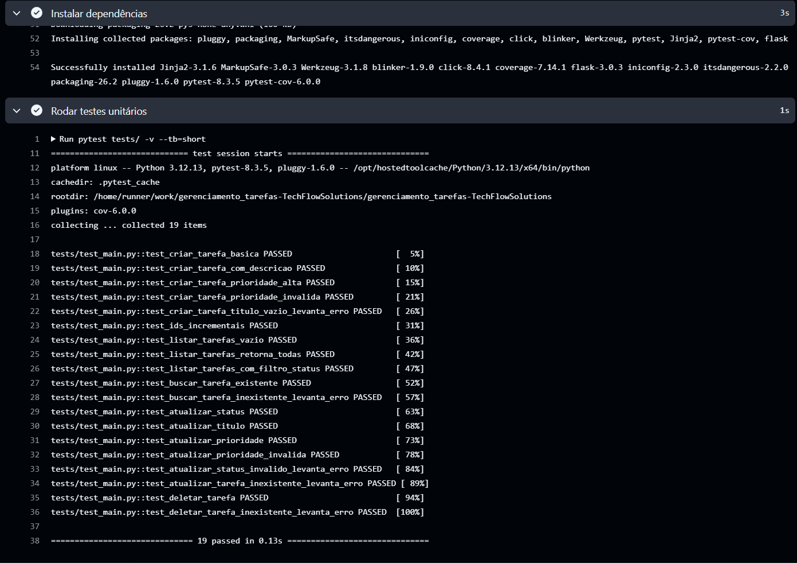
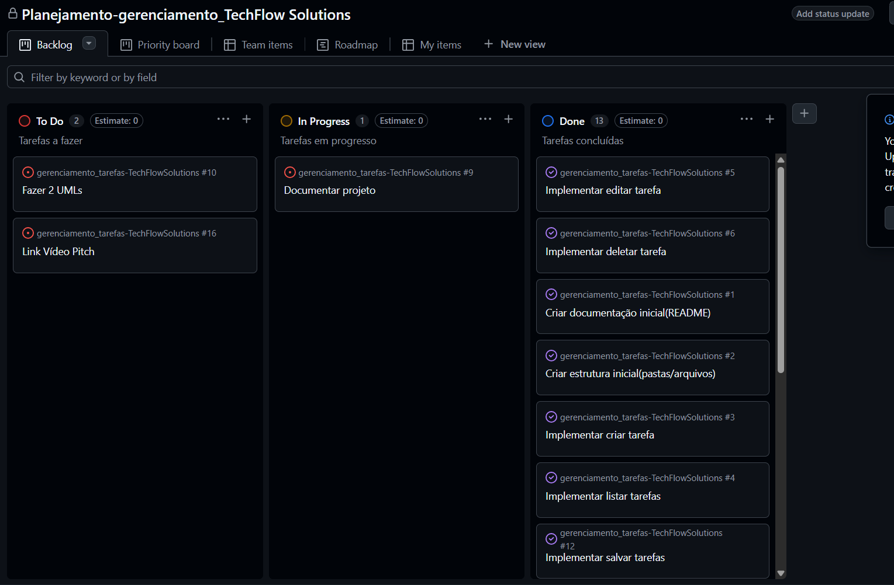
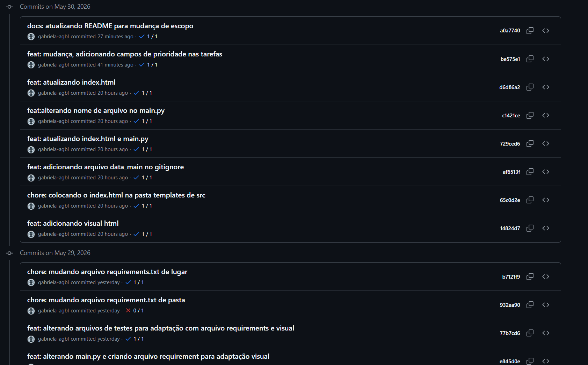
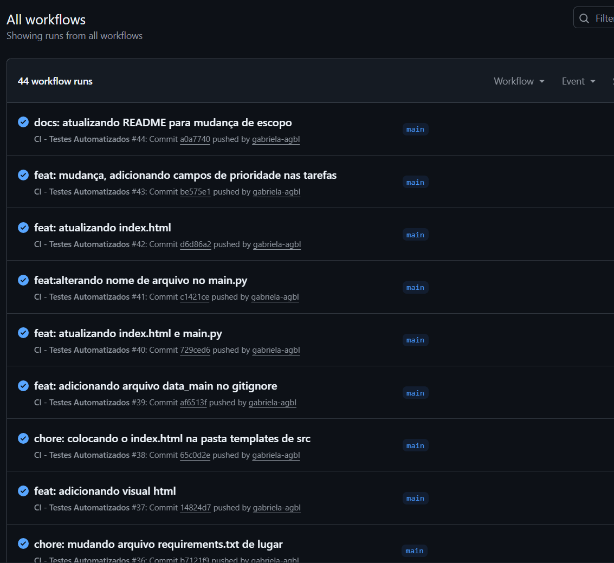

# Documentação Técnica — TaskFlow

**Disciplina:** Engenharia de Software EAD
**Instituição:** UniFECAF  
**Empresa fictícia:** TechFlow Solutions  
**Aluna:** Gabriela Rodrigues de Souza  
**Data:** Maio de 2025

---

## 1. Descrição do Projeto e Escopo Inicial

A **TechFlow Solutions**, empresa fictícia especializada em soluções de software, foi contratada por uma startup de logística para desenvolver um sistema de gerenciamento de tarefas baseado em metodologias ágeis. O sistema permite acompanhar o fluxo de trabalho em tempo real, organizar tarefas em um quadro Kanban visual e monitorar o progresso da equipe.

### 1.1 Escopo Inicial

O sistema foi planejado para contemplar as seguintes funcionalidades essenciais:

- Criar tarefas com título e descrição
- Listar tarefas organizadas por status em quadro Kanban visual
- Buscar tarefas em tempo real pelo título ou descrição
- Editar título e descrição de tarefas existentes
- Atualizar status movendo tarefas entre as colunas: A Fazer, Em Progresso e Concluído
- Deletar tarefas
- Persistência local em arquivo JSON

### 1.2 Tecnologias Utilizadas

| Tecnologia | Versão | Finalidade |
|---|---|---|
| Python | 3.12 | Linguagem principal |
| Flask | 3.0.3 | Framework web |
| Pytest | 8.3.5 | Testes unitários |
| pytest-cov | 6.0.0 | Cobertura de testes |
| GitHub Actions | — | Integração contínua (CI) |
| GitHub Projects | — | Gestão ágil (Kanban) |
| JSON | — | Persistência de dados |

---

## 2. Metodologia Ágil Utilizada

O projeto adota o **Kanban** como metodologia principal de gestão. O Kanban é uma abordagem visual que permite gerenciar o fluxo de trabalho de forma transparente, limitando o trabalho em progresso e priorizando a entrega contínua de valor.

### 2.1 Quadro Kanban

O quadro foi organizado em três colunas representando os estados possíveis de cada tarefa:

| Coluna | Descrição |
|---|---|
| To Do (A Fazer) | Tarefas planejadas ainda não iniciadas |
| In Progress (Em Progresso) | Tarefas em desenvolvimento ativo pela equipe |
| Done (Concluído) | Tarefas finalizadas e validadas |

### 2.2 Princípios Ágeis Aplicados

- **Entrega contínua:** funcionalidades implementadas e testadas em ciclos curtos
- **Colaboração:** uso do GitHub para versionamento e rastreabilidade das mudanças
- **Adaptação:** mudança de escopo gerenciada e documentada ao longo do projeto
- **Qualidade:** testes automatizados garantindo a confiabilidade do código

---

## 3. Importância da Modelagem na Engenharia de Software

A modelagem é uma etapa fundamental no desenvolvimento de software pois permite visualizar, especificar, construir e documentar um sistema antes de sua implementação. Ela serve como uma linguagem comum entre desenvolvedores, gestores e clientes, reduzindo ambiguidades e antecipando problemas.

Na Engenharia de Software, a **UML (Unified Modeling Language)** é o padrão mais utilizado para modelagem. Ela oferece diferentes tipos de diagramas que cobrem aspectos estruturais e comportamentais do sistema, facilitando a comunicação entre a equipe e servindo de referência durante todo o ciclo de vida do software.

No contexto deste projeto, a modelagem permitiu:

- Identificar os atores do sistema e suas interações (Diagrama de Casos de Uso)
- Definir a estrutura das classes e seus relacionamentos (Diagrama de Classes)
- Antecipar a separação de responsabilidades entre camadas da aplicação
- Facilitar a comunicação com o cliente sobre o escopo do sistema

---

## 4. Diagramas UML

### 4.1 Diagrama de Casos de Uso

O Diagrama de Casos de Uso representa as interações entre o ator principal (Usuário) e as funcionalidades do sistema. O diagrama é dividido em dois lados: **ações do usuário** (o que ele dispara) e **respostas do sistema** (o que acontece automaticamente).

**Descrição dos casos de uso:**

| Ação do Usuário | Resposta do Sistema |
|---|---|
| Criar tarefa | Salvar no JSON |
| Buscar tarefa | Filtrar cards em tempo real |
| Editar tarefa | Atualizar registro |
| Atualizar status | Mover coluna Kanban |
| Deletar tarefa | Remover registro |
| — (automático ao carregar) | Exibir Kanban |

### 4.2 Diagrama de Classes

O Diagrama de Classes representa a estrutura estática do sistema, mostrando as classes, seus atributos, métodos e os relacionamentos entre elas.

**Descrição das classes:**

**`Tarefa`**
- Atributos preenchidos pelo usuário: `titulo`, `descricao`, `prioridade`, `status`
- Atributos gerados pelo sistema: `id`, `criado_em`, `atualizado_em`
- Método: `to_dict()`

**`TarefaRepositorio`**
- Responsável pela persistência dos dados
- Métodos: `carregar()`, `salvar()`, `criar()`, `listar()`, `buscar()`, `atualizar()`, `deletar()`

**`FlaskApp`**
- Camada de apresentação que recebe as requisições HTTP
- Rotas: `index()`, `criar()`, `editar()`, `atualizar()`, `deletar()`
- Relacionamento: usa `TarefaRepositorio` (dependência)

---

## 5. Mudança de Escopo

### 5.1 Justificativa

Durante o desenvolvimento do sistema, o cliente (startup de logística) identificou a necessidade de diferenciar tarefas urgentes das demais para otimizar a priorização operacional da equipe. Com base nessa demanda, foi incluído o campo **prioridade** ao sistema, representando uma mudança controlada no escopo do projeto.

### 5.2 O que Mudou

| Aspecto | Antes | Depois |
|---|---|---|
| Campo prioridade | Não existia | Valores: baixa, média, alta |
| Função `criar_tarefa()` | Título e descrição | Título, descrição e prioridade |
| Interface web | Sem exibição de prioridade | Badge colorido por prioridade |
| Testes | Sem testes de prioridade | Testes de validação adicionados |

### 5.3 Como Foi Gerenciada

- Novo card criado no Kanban do GitHub Projects
- Novo commit implementando a mudança com mensagem semântica
- `README.md` atualizado com a justificativa e descrição da mudança
- Testes unitários atualizados para cobrir o novo campo

---

## 6. Testes Automatizados

Os testes automatizados são essenciais para garantir que o sistema se comporta como esperado após cada alteração no código. No projeto TaskFlow, utilizamos o **Pytest** como framework de testes, cobrindo todas as operações CRUD.

### 6.1 Casos de Teste

| Operação | Caso de Teste | Resultado Esperado |
|---|---|---|
| CREATE | Criar tarefa com título válido | Tarefa criada com ID e status `a_fazer` |
| CREATE | Criar tarefa com título vazio | `ValueError` levantado |
| CREATE | Criar com prioridade inválida | `ValueError` levantado |
| CREATE | IDs incrementais | IDs sequenciais (1, 2, 3...) |
| READ | Listar sem tarefas | Lista vazia retornada |
| READ | Listar com filtro de status | Apenas tarefas do status filtrado |
| READ | Buscar por ID existente | Tarefa correta retornada |
| READ | Buscar por ID inexistente | `ValueError` levantado |
| UPDATE | Atualizar status válido | Status atualizado corretamente |
| UPDATE | Atualizar prioridade | Prioridade atualizada corretamente |
| UPDATE | Atualizar status inválido | `ValueError` levantado |
| DELETE | Deletar tarefa existente | `True` retornado, tarefa removida |
| DELETE | Deletar ID inexistente | `ValueError` levantado |

### 6.2 GitHub Actions — Pipeline de CI

O pipeline de integração contínua foi configurado para rodar automaticamente a cada push na branch `main`. O arquivo `.github/workflows/ci.yml` define as etapas:

1. Checkout do repositório
2. Configuração do ambiente Python 3.12
3. Instalação das dependências via `requirements.txt`
4. Execução dos testes com Pytest
5. Relatório de cobertura de código

---

## 7. Prints do GitHub

### 7.1 Quadro Kanban

### 7.2 Commits Relevantes

### 7.3 Workflow de CI Funcionando

---

## 8. Questões Norteadoras

### 8.1 Principais causas de falhas em projetos ágeis e como o GitHub ajuda

As principais causas de falha em projetos ágeis incluem má gestão de tarefas, falta de comunicação entre membros da equipe e ausência de rastreabilidade das mudanças. O GitHub mitiga esses problemas oferecendo o **GitHub Projects** para gestão visual do Kanban, o histórico de commits para rastrear cada alteração e o sistema de Issues para registrar e discutir tarefas. Assim, toda a equipe tem visibilidade do progresso em tempo real.

### 8.2 Principais beneficiados pelo sistema

Os principais beneficiados são: (1) a **equipe de desenvolvimento**, que organiza suas tarefas no Kanban e acompanha o progresso de cada entrega; (2) os **gestores de projeto**, que monitoram o andamento em tempo real e identificam gargalos; (3) o **cliente final** (startup de logística), que recebe entregas mais rápidas e confiáveis.

### 8.3 Como o GitHub Actions garante qualidade

O GitHub Actions executa os testes automaticamente a cada push, garantindo que nenhuma alteração quebre o funcionamento do sistema. Isso implementa o conceito de **integração contínua (CI)**, onde o código é validado constantemente — e não apenas antes da entrega. O relatório de cobertura também indica quais partes do código ainda não estão sendo testadas, orientando melhorias.

### 8.4 Desafios ao implementar mudanças em projetos ágeis

Os principais desafios são manter a consistência do sistema ao adicionar novas funcionalidades, comunicar claramente o impacto da mudança para a equipe e atualizar a documentação e os testes. Neste projeto, a mudança de escopo (adição do campo `prioridade`) foi gerenciada com um novo card no Kanban, um commit dedicado e atualização do README, demonstrando que mudanças podem ser incorporadas de forma controlada.

### 8.5 Aplicação das metodologias ágeis neste projeto

O Kanban foi aplicado diretamente no GitHub Projects, com tarefas movendo-se entre To Do, In Progress e Done conforme o desenvolvimento avançava. Os commits semânticos (`feat:`, `fix:`, `docs:`, `test:`, `ci:`) refletem a prática de registrar o histórico de forma clara. A mudança de escopo foi tratada como um novo item do backlog, priorizada e implementada em ciclo curto — princípios fundamentais das metodologias ágeis estudadas.